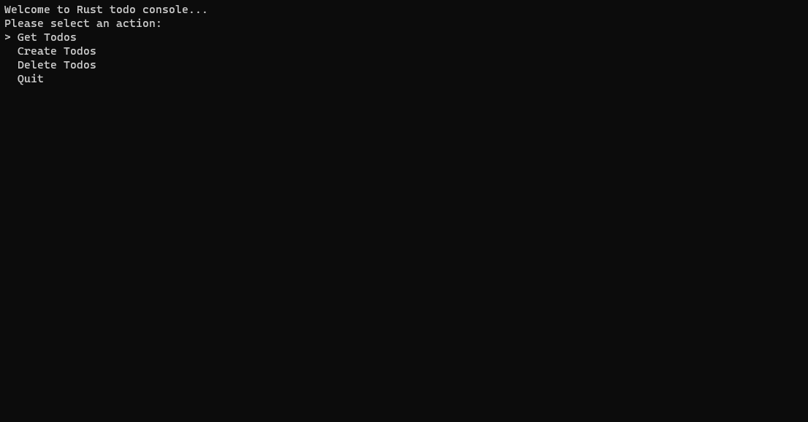

# Rust Todo Console

A straightforward console-based Todo application developed with Rust, allowing users to create, and delete tasks.

## Table of Contents

- [Demo](#demo)
- [Features](#features)
- [Prerequisites](#prerequisites)
- [Getting Started](#getting-started)
- [Usage](#usage)
- [Contributing](#contributing)
- [License](#license)

## Demo

Video demo soon

## Features

- **Create todos:** Create a todo.

- **Get todos:** Easily get content of all existing todos.

- **Delete todos:** Select and Remove unwanted todos from your collection.

## Prerequisites

Before you can use the Rust Todo Console application, ensure you have the following dependencies installed:

Rust

## Getting Started

1. clone the repo

2. cargo run in the root folder or cargo build and find the exe in the folder target/debug

3. application will run. a list.json will be created using this app to keep track of todos

4. enjoy

## Usage

- Launch the application to access the Rust Todo Console interface.
- Create new tasks by following the prompts.
- Delete tasks using the delete option.
- Get tasks from the list

## Contributing

Contributions from the community are welcome. If you'd like to enhance this Todo Console application, follow these steps

1. Fork the repository to your GitHub account.
2. Create a new branch for your feature or bug fix.
3. Make your changes and commit them.
4. Push your changes to your fork.
5. Create a pull request, explaining the purpose of your changes.

I'll review your pull request and merge it if it aligns with the project's goals.

## Issues

Please submit any issues while running or trying to start the application. 

## License

his project is licensed under the MIT License, allowing you to use, modify, and distribute the code freely. Please provide appropriate credit.